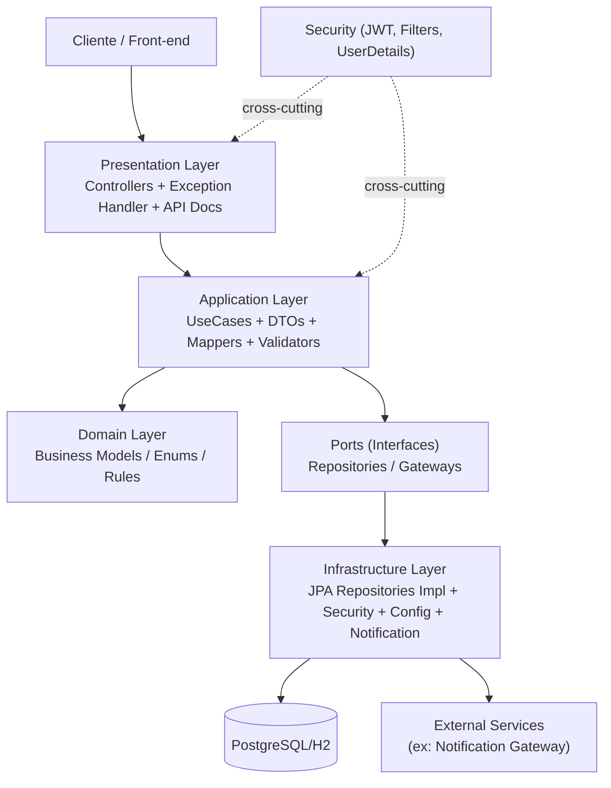

# Documentacao de Arquitetura

Este documento descreve a arquitetura do projeto `FIAP Pos Tech - Tech Challenge 1`, incluindo camadas, responsabilidades, fluxo de dependencia e principais decisoes.

## 1) Visao Geral

A aplicacao segue uma organizacao em camadas com separacao clara entre:

- `presentation`: entrada HTTP e contratos da API
- `application`: orquestracao de casos de uso
- `domain`: conceitos e regras centrais de negocio
- `infrastructure`: detalhes tecnicos (persistencia, seguranca, configuracao, integracoes)

Objetivo principal:

- manter regras de negocio desacopladas de frameworks e detalhes tecnicos
- facilitar manutencao, testes e evolucao

## 2) Diagrama da Arquitetura



## 3) Responsabilidades por Camada

### 3.1 Presentation

Pacotes principais:

- `presentation.api`
- `presentation.api.doc`
- `presentation.exceptionHandler`

Responsabilidades:

- receber requisicoes HTTP
- validar entrada em nivel de API
- delegar para casos de uso da camada `application`
- retornar resposta HTTP com codigos e payload adequados

### 3.2 Application

Pacotes principais:

- `application.usecase`
- `application.dto`
- `application.mapper`
- `application.validator`
- `application.gateway` (contratos)

Responsabilidades:

- implementar casos de uso
- orquestrar entidades, repositorios e gateways
- aplicar regras de fluxo da aplicacao
- converter entre DTOs e modelos de persistencia quando necessario

### 3.3 Domain

Pacotes principais:

- `domain.model`

Responsabilidades:

- representar conceitos de negocio puros
- manter tipos centrais usados por regras de negocio

Exemplos atuais:

- `StatusOrdemServico`
- `PerfilUsuario`

### 3.4 Infrastructure

Pacotes principais:

- `infrastructure.persistence.entity`
- `infrastructure.persistence.repository`
- `infrastructure.security`
- `infrastructure.config`
- `infrastructure.notification`

Responsabilidades:

- implementar acesso a dados com JPA
- configurar seguranca (JWT, filtros, handlers)
- configurar componentes tecnicos da aplicacao
- implementar integracoes externas (ex.: notificacao)

## 4) Linguagem Ubiqua e Aplicacao

A linguagem ubiqua define um vocabulario unico entre negocio e tecnologia, reduzindo ambiguidade entre requisitos, codigo e documentacao.

Termos centrais adotados no projeto:

- `OrdemServico`: unidade principal do processo da oficina
- `StatusOrdemServico`: estado atual da ordem (`RECEBIDA`, `EM_DIAGNOSTICO`, `AGUARDANDO_APROVACAO`, `EM_EXECUCAO`, `FINALIZADA`, `ENTREGUE`)
- `Orcamento`: valor proposto para execucao dos servicos
- `AprovacaoOrcamento`: decisao do cliente (aprovar ou rejeitar)
- `Cliente`, `Veiculo`, `Servico`, `Peca`, `Insumo`: entidades de negocio utilizadas no ciclo da ordem
- `PerfilUsuario`: papel de acesso do usuario (`ADMIN`, `ATENDENTE`, `MECANICO`, `CLIENTE`)
- `AcompanhamentoOrdemServico`: visao de progresso da ordem para consulta

Aplicacao pratica da linguagem ubiqua:

- no `domain`, os conceitos de negocio sao representados por tipos nomeados conforme o dominio (ex.: `StatusOrdemServico`, `PerfilUsuario`)
- na `application`, os casos de uso e DTOs usam os mesmos termos do negocio para manter rastreabilidade entre requisito e implementacao
- na `presentation`, endpoints e contratos refletem o mesmo vocabulario para evitar traducao inconsistente entre API e regra de negocio
- na documentacao (arquitetura e API), os nomes mantem o mesmo significado tecnico-funcional usado no codigo

Resultado esperado:

- comunicacao mais clara entre equipe tecnica e avaliadores
- menor risco de erro por interpretacao
- maior facilidade de manutencao e evolucao das regras de negocio

## 5) Regra de Dependencia

Direcao recomendada de dependencia:

- `presentation` -> `application`
- `application` -> `domain` e contratos (ports)
- `infrastructure` -> implementa contratos e usa frameworks

Principio aplicado:

- detalhes tecnicos nao devem ditar regras de negocio
- o nucleo de negocio deve permanecer independente de framework

## 6) Persistencia e Domain

A camada de persistencia nao pertence ao `domain`.

- `domain` contem negocio
- persistencia e detalhe tecnico, logo fica em `infrastructure`

Boa pratica:

- contratos de repositorio/gateway podem ficar na camada de negocio/aplicacao
- implementacoes concretas ficam em `infrastructure`

## 7) Fluxo Tipico de Requisicao

1. Cliente chama endpoint REST
2. Controller (`presentation`) recebe e delega
3. Use case (`application`) executa regra de negocio
4. Repositorio/gateway (contrato) e acionado
5. Implementacao em `infrastructure` acessa banco/integracao
6. Resultado retorna para `application`, depois `presentation`, e entao ao cliente

## 8) Beneficios da Arquitetura

- alta coesao por responsabilidade
- menor acoplamento entre negocio e tecnologia
- facilidade para testes unitarios e de integracao
- evolucao segura de banco, seguranca e integracoes
- maior clareza para documentacao e defesa do projeto

## 9) Estrutura Atual (resumida)

```text
src/main/java/com/postech/challenge
  application
    dto
    mapper
    usecase
    validator
    gateway
  domain
    model
  infrastructure
    config
    persistence
      entity
      repository
    security
    notification
  presentation
    api
    api/doc
    exceptionHandler
```
