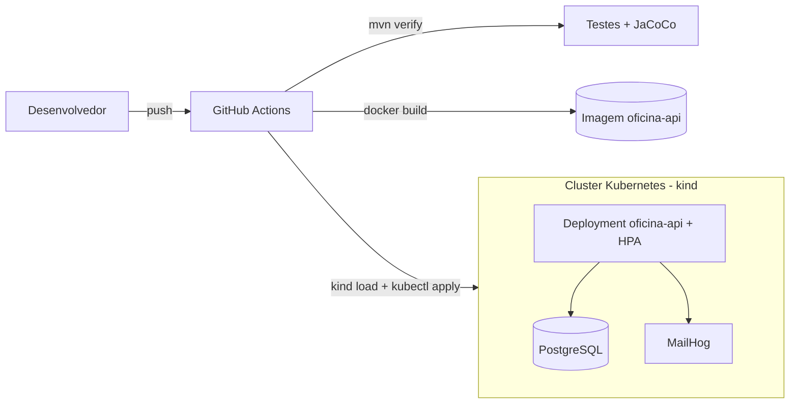

# FIAP Pos Tech - Tech Challenge (Fase 2)

API backend para gerenciamento de oficina mecânica, evoluída na Fase 2 com **Clean Architecture +
domínio rico (DDD)**, validação de entrada, notificação por e-mail e infraestrutura local
(Kubernetes via kind, Terraform e CI/CD).

Este projeto contempla:
- Domínio rico: agregado `OrdemServico` com máquina de estados (a regra de transição mora no agregado)
- Ciclo de vida e acompanhamento de ordens de serviço
- Listagem de OS ativas ordenada por status (com exclusão lógica de finalizadas/entregues)
- Gestão de clientes, veículos, serviços, peças e insumos
- Autenticação JWT com autorização por perfil (segredo externalizado por variável de ambiente)
- Validação de DTOs com Hibernate Validator (Jakarta Bean Validation)
- Notificação de mudança de status por e-mail (MailHog no ambiente local)
- Monitoramento de tempo médio de execução de serviços
- Documentação OpenAPI/Swagger
- Testes automatizados (unitários + integração com Testcontainers) e cobertura via JaCoCo
- Manifestos Kubernetes (`/k8s`), IaC com Terraform (`/infra`) e pipeline CI/CD (`.github/workflows`)

## Documentação de Arquitetura e Modelagem

- `DOCUMENTACAO_ARQUITETURA.md`: diagrama em camadas, responsabilidades e fluxo de dependências.
- `docs/DOMAIN_STORYTELLING.md`: Domain Storytelling (atores, narrativa e diagrama).
- `docs/EVENT_STORMING.md`: Event Storming evoluído (brainstorm, linha do tempo, eventos pivotais,
  comandos, políticas, agregados e contextos delimitados).

## 1) Stack Tecnológica

- Java 25
- Spring Boot 4
- Spring Security (JWT)
- Spring Data JPA
- Spring Validation (Hibernate Validator)
- Spring Mail (MailHog/Mailpit local)
- Spring Boot Actuator (health probes)
- PostgreSQL 15
- Springdoc OpenAPI (Swagger UI)
- Docker + Docker Compose
- JUnit 5 + Mockito + Testcontainers
- JaCoCo
- Kubernetes (kind) + Terraform
- GitHub Actions (CI/CD)

## 2) Início Rápido (avaliador primeira execução)

Se for a primeira execução, use Docker (recomendado):

1. Copie o arquivo de ambiente:

```bash
cp .env.example .env
```

2. Suba os serviços:

```bash
docker-compose up --build
```

3. Acesse:
- Swagger UI: `http://localhost:8080/swagger-ui.html`
- OpenAPI JSON: `http://localhost:8080/v3/api-docs`

4. Faça login com usuário admin bootstrap:
- Email: `admin@oficina.com`
- Senha: `admin123`

Esse usuário é criado automaticamente na inicialização pelo `AdminUserBootstrap` (caso não exista).

## 3) Pré-requisitos

Você pode seguir por um dos caminhos:

- **Com Docker (recomendado):**
  - Docker
  - Docker Compose

- **Sem Docker (local):**
  - Java 25
  - PostgreSQL 15
  - Maven 3.9+ (ou `mvnw`)

## 4) Execução da Aplicação

### 4.1 Com Docker

```bash
cp .env.example .env
docker-compose up --build
```

Parar containers:

```bash
docker-compose down
```

Parar e remover volume do banco:

```bash
docker-compose down -v
```

### 4.2 Sem Docker (local)

1. Crie o banco:

```sql
CREATE DATABASE oficina_mec_db;
```

2. Configure o `application.properties` localmente (obrigatório para avaliador em primeira execução).

Use o arquivo de exemplo como base:

```bash
cp src/main/resources/application.properties.example src/main/resources/application.properties
```

No Windows PowerShell:

```powershell
copy src\main\resources\application.properties.example src\main\resources\application.properties
```

Depois ajuste os valores locais no `src/main/resources/application.properties`.

Exemplo mínimo de configuração local:

```properties
spring.datasource.url=jdbc:postgresql://localhost:5432/oficina_mec_db
spring.datasource.username=admin
spring.datasource.password=admin
spring.jpa.hibernate.ddl-auto=update
spring.sql.init.mode=always
```

Arquivo de referência utilizado:
- `src/main/resources/application.properties.example`

3. Configure variáveis de ambiente (exemplo bash), se necessário:

```bash
export POSTGRES_HOST=localhost
export POSTGRES_PORT=5432
export POSTGRES_DB=oficina_mec_db
export POSTGRES_USER=admin
export POSTGRES_PASSWORD=admin
export SPRING_JPA_HIBERNATE_DDL_AUTO=update
export SPRING_SQL_INIT_MODE=always
```

4. Inicie a aplicação:

```bash
./mvnw spring-boot:run
```

No Windows PowerShell:

```powershell
.\mvnw.cmd spring-boot:run
```

## 5) Variáveis de Ambiente

Os padrões estão no `.env.example`.

| Variável | Padrão | Descrição |
|---|---|---|
| `POSTGRES_HOST` | `localhost` | Host do PostgreSQL |
| `POSTGRES_PORT` | `5432` | Porta do PostgreSQL |
| `POSTGRES_DB` | `oficina_mec_db` | Nome do banco |
| `POSTGRES_USER` | `admin` | Usuário do banco |
| `POSTGRES_PASSWORD` | `admin` | Senha do banco |
| `SPRING_JPA_HIBERNATE_DDL_AUTO` | `update` | Estratégia de schema do Hibernate |
| `SPRING_SQL_INIT_MODE` | `always` | Inicialização SQL |
| `JWT_SECRET` | (dev) | Segredo de assinatura JWT (externalizado; **defina um valor forte em produção**) |
| `JWT_ACCESS_EXPIRATION_MS` | `3600000` | Validade do access token (ms) |
| `JWT_REFRESH_EXPIRATION_MS` | `604800000` | Validade do refresh token (ms) |
| `MAIL_HOST` | `localhost`/`mailhog` | Host SMTP (MailHog no Docker/k8s) |
| `MAIL_PORT` | `1025` | Porta SMTP do MailHog |
| `NOTIFICACAO_EMAIL_REMETENTE` | `oficina@oficina.com` | Remetente das notificações |
| `NOTIFICACAO_EMAIL_DESTINATARIO` | `notificacoes@oficina.com` | Destinatário das notificações de status |

> **Segurança / Sonar:** o `jwt.secret` deixou de ser fixo no código e passa a ser lido de `JWT_SECRET`
> (variável de ambiente / Secret do Kubernetes), eliminando o segredo hardcoded apontado pelo Sonar.

### E-mail local (MailHog)

Ao subir via Docker Compose, a interface web do MailHog fica disponível em
`http://localhost:8025`. Toda mudança de status relevante da OS gera um e-mail visível ali.

## 6) Autenticação e Autorização

### 6.1 Endpoints públicos de autenticação

- `POST /api/auth/register`
- `POST /api/auth/login`
- `POST /api/auth/refresh`

### 6.2 Usuário admin padrão

Na inicialização, se não existir:
- email: `admin@oficina.com`
- senha: `admin123`
- perfil: `ADMIN`

### 6.3 Perfis disponíveis

- `ADMIN`
- `ATENDENTE`
- `MECANICO`

### 6.4 Uso do token JWT

Enviar no header:

```text
Authorization: Bearer <accessToken>
```

### 6.5 Autenticação no Swagger

1. Execute o login no Swagger
2. Copie o `accessToken`
3. Clique em `Authorize`
4. Cole o token e confirme

## 7) Módulos da API (visão geral)

- `Clientes`: CRUD
- `Veiculos`: CRUD + validação de placa
- `Servicos`: CRUD
- `Pecas`: CRUD + estoque
- `Insumos`: CRUD + estoque
- `Ordens de Servico`:
  - CRUD
  - criação por CPF/CNPJ
  - inclusão de peças
  - transições de status (diagnóstico, orçamento, aprovação, execução, finalização, entrega)
  - endpoint de acompanhamento para cliente
- `Monitoramento`:
  - tempo médio de execução por serviço

## 8) Testes e Cobertura

Executar todos os testes:

```bash
./mvnw test
```

No Windows PowerShell:

```powershell
.\mvnw.cmd test
```

Executar verificação completa (testes + JaCoCo + regra de cobertura):

```bash
./mvnw verify
```

Relatório JaCoCo:

- `target/site/jacoco/index.html`

Abrir no Windows:

```powershell
start target\site\jacoco\index.html
```

A verificação de cobertura está configurada no `pom.xml`.

## 9) Comandos Úteis

Build sem testes:

```bash
./mvnw clean package -DskipTests
```

Executar uma classe de teste específica:

```bash
./mvnw -Dtest=AuthServiceUsecaseTest test
```

## 10) Estrutura do Projeto (resumida)

```text
src/main/java/com/postech/challenge
  domain                 # núcleo de negócio puro (sem dependência de framework)
    model                # agregado OrdemServico + StatusOrdemServico
    model/vo             # value objects: CpfCnpj, Placa
    exception            # DomainException, TransicaoStatusInvalidaException
  application
    dto
    mapper
    usecase
    validator
    gateway              # ports (ex.: NotificacaoOrdemServicoGateway)
  infrastructure
    config
    persistence
      entity
      repository         # ports (interfaces) + implementações JPA
    security
    notification         # EmailNotificacaoGatewayImpl (JavaMailSender)
  presentation
    api
    api/doc

docs/                    # Domain Storytelling e Event Storming
k8s/                     # manifestos Kubernetes (namespace, configmap, secret, db, mailhog, app, hpa)
infra/                   # Terraform (kind + kubernetes + database + metrics-server)
.github/workflows/       # pipeline CI/CD
```

## 10.1) Kubernetes (kind), Terraform e CI/CD

### Arquitetura de deploy



### Pré-requisitos de infraestrutura (instalação das ferramentas)

Para rodar a stack local você precisa de **Docker**, **Terraform**, **kind** e **kubectl**.

#### Windows (winget)

```powershell
winget install --id Hashicorp.Terraform -e
winget install --id Kubernetes.kubectl -e
winget install --id Kubernetes.kind -e
```

> Após instalar, **abra um novo terminal** para o `PATH` ser atualizado. Valide com `terraform -version`, `kubectl version --client` e `kind version`.

#### macOS (Homebrew)

```bash
brew tap hashicorp/tap
brew install hashicorp/tap/terraform
brew install kubectl
brew install kind
```

#### Linux (Ubuntu/Debian)

```bash
# Terraform
wget -O- https://apt.releases.hashicorp.com/gpg | sudo gpg --dearmor -o /usr/share/keyrings/hashicorp-archive-keyring.gpg
echo "deb [signed-by=/usr/share/keyrings/hashicorp-archive-keyring.gpg] https://apt.releases.hashicorp.com $(lsb_release -cs) main" | sudo tee /etc/apt/sources.list.d/hashicorp.list
sudo apt update && sudo apt install terraform

# kubectl
curl -LO "https://dl.k8s.io/release/$(curl -L -s https://dl.k8s.io/release/stable.txt)/bin/linux/amd64/kubectl"
sudo install -o root -g root -m 0755 kubectl /usr/local/bin/kubectl

# kind
curl -Lo ./kind https://kind.sigs.k8s.io/dl/latest/kind-linux-amd64
chmod +x ./kind && sudo mv ./kind /usr/local/bin/kind
```

### Terraform (provisiona cluster + banco)

```bash
cd infra
terraform init
terraform apply -auto-approve
```

Detalhes dos recursos e passos completos em `infra/README.md`.

### Kubernetes (deploy da aplicação)

```bash
docker build -t oficina-api:latest .
kind load docker-image oficina-api:latest --name oficina-cluster
kubectl apply -f k8s/
kubectl -n oficina get pods
# aplicação exposta via NodePort em http://localhost:30080
```

Os manifestos incluem `ConfigMap`, `Secret`, probes de liveness/readiness, `resources`
requests/limits e um `HorizontalPodAutoscaler` (requer metrics-server, instalado pelo Terraform).

### CI/CD (GitHub Actions)

O workflow `.github/workflows/ci-cd.yml` executa, a cada push/PR para `main`:

1. **Build & Test** — `./mvnw verify` (inclui testes de integração com Testcontainers) e publica o relatório JaCoCo.
2. **Docker image** — build da imagem da aplicação.
3. **Deploy to kind** — cria um cluster kind efêmero, carrega a imagem, aplica os manifestos de `k8s/` e valida o rollout.

## 11) Solução de Problemas

### Porta em uso
- Altere portas no `docker-compose.yml` ou finalize o processo que está ocupando a porta.

### Falha de conexão com banco
- Verifique os valores do `.env`
- Confirme que PostgreSQL está ativo
- Confirme `POSTGRES_HOST` e `POSTGRES_PORT`

### Swagger não abre
- Verifique se a aplicação está rodando na porta `8080`
- Acesse `http://localhost:8080/swagger-ui.html`

### Erros JWT (401/403)
- Verifique validade do token
- Verifique perfil/role com permissão no endpoint
- Verifique header `Authorization: Bearer <token>`

## 12) Roteiro sugerido para avaliação

1. `cp .env.example .env`
2. `docker-compose up --build`
3. Acessar Swagger
4. Fazer login com `admin@oficina.com` / `admin123`
5. Validar endpoints principais
6. Executar `./mvnw verify`
