# Diagrama de Arquitetura — Tech Challenge Fase 2

Documento visual da arquitetura da solução de gestão de oficina mecânica, contemplando **componentes da aplicação**, **infraestrutura provisionada** e **fluxo de deploy**, conforme exigido na entrega da Fase 2.

Documentos complementares:

- `DOCUMENTACAO_ARQUITETURA.md` — detalhamento textual das camadas e decisões
- `docs/DOMAIN_STORYTELLING.md` — narrativa de domínio
- `docs/EVENT_STORMING.md` — eventos, comandos e agregados
- `infra/README.md` — recursos Terraform e comandos de provisionamento

---

## 1) Visão geral da solução

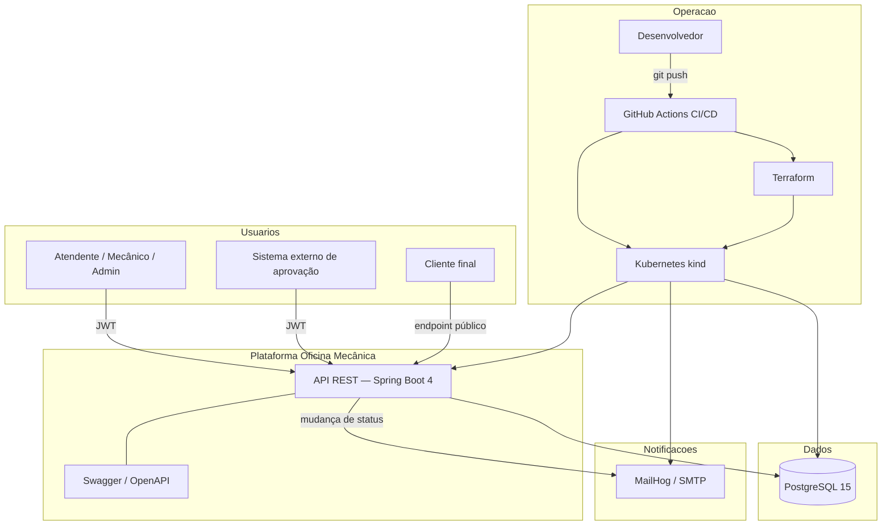

**Resumo:** API stateless com autenticação JWT, persistência em PostgreSQL e notificações por e-mail. A infraestrutura local é provisionada com Terraform (cluster + banco) e complementada com manifestos Kubernetes; o deploy é automatizado via GitHub Actions.

---

## 2) Arquitetura de software (Clean Architecture)

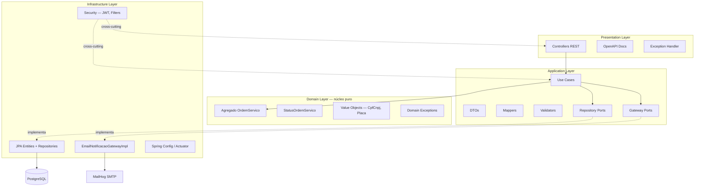

### Regra de dependência

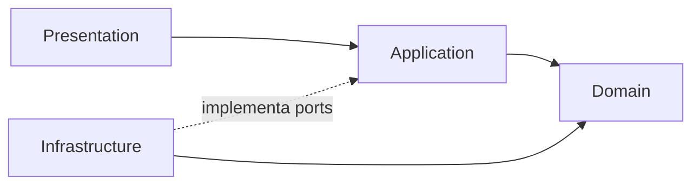

| Camada | Pacote | Responsabilidade |
|--------|--------|------------------|
| Presentation | `presentation.api` | Endpoints HTTP, contratos Swagger |
| Application | `application.usecase` | Orquestração de casos de uso |
| Domain | `domain.model` | Regras de negócio e máquina de estados |
| Infrastructure | `infrastructure.*` | JPA, JWT, e-mail, configuração |

---

## 3) Componentes da aplicação

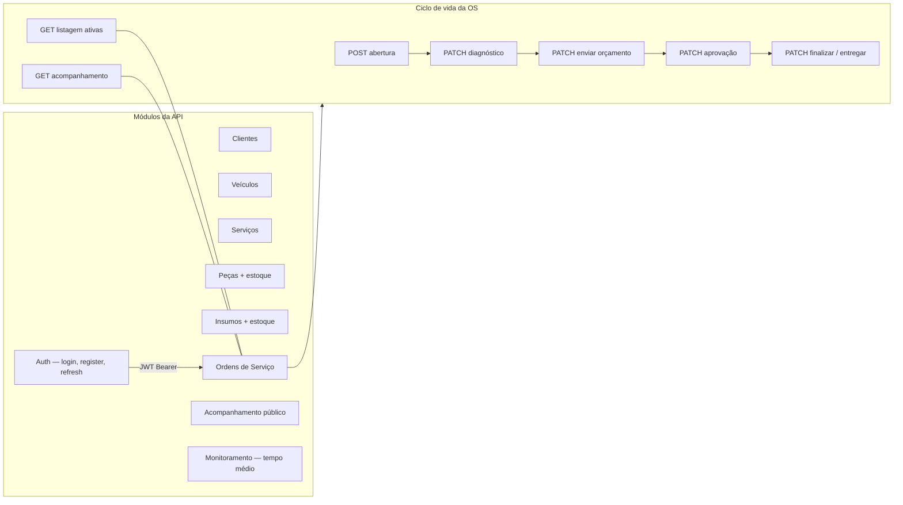

### Endpoints principais (requisitos da Fase 2)

| Requisito | Endpoint | Autenticação |
|-----------|----------|--------------|
| Abertura de OS | `POST /api/ordens-servico` ou `/cliente` | JWT |
| Consulta de status | `GET /api/public/ordens-servico/{id}/acompanhamento` | Pública (CPF/CNPJ) |
| Aprovação de orçamento | `PATCH /api/ordens-servico/{id}/orcamento/aprovacao` | JWT |
| Listagem ordenada | `GET /api/ordens-servico/ativas` | JWT |
| Notificação por e-mail | Disparada nas transições de status | — |

### Máquina de estados — Ordem de Serviço

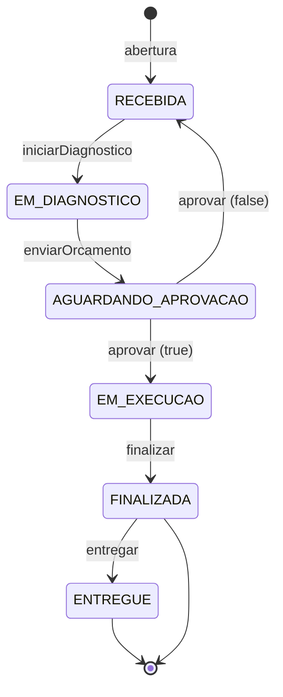

> A lógica de transição reside no agregado `OrdemServico` (`domain.model`). Cada transição válida pode disparar e-mail via `NotificacaoOrdemServicoGateway`.

---

## 4) Infraestrutura provisionada

### 4.1 Ambiente local — Docker Compose

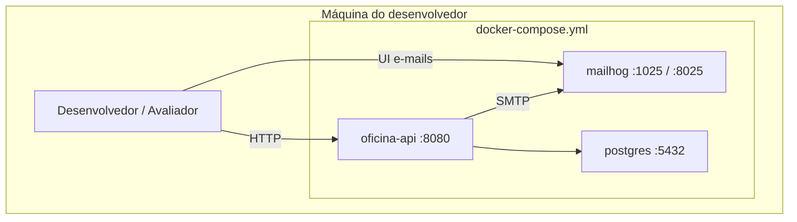

| Serviço | Imagem / Build | Porta |
|---------|----------------|-------|
| `app` | `Dockerfile` (multi-stage Maven + JRE) | 8080 |
| `db` | `postgres:15-alpine` | 5432 |
| `mailhog` | `mailhog/mailhog` | 1025 (SMTP), 8025 (UI) |

---

### 4.2 Ambiente Kubernetes — recursos

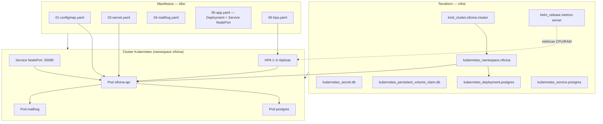

### Inventário de recursos

| Origem | Recurso | Finalidade |
|--------|---------|------------|
| Terraform | Cluster kind | Kubernetes local com NodePort 30080 exposto no host |
| Terraform | Namespace `oficina` | Isolamento dos recursos da aplicação |
| Terraform | metrics-server (Helm) | Métricas para o HorizontalPodAutoscaler |
| Terraform | PostgreSQL (Deploy + SVC + Secret + PVC) | Banco de dados persistente |
| k8s | ConfigMap `oficina-config` | Variáveis não sensíveis (host DB, mail, JPA) |
| k8s | Secret `oficina-secret` | JWT, credenciais do banco |
| k8s | Deployment + Service MailHog | Captura de e-mails em ambiente local |
| k8s | Deployment + Service `oficina-api` | API com probes e resource limits |
| k8s | HorizontalPodAutoscaler | Escala automática por CPU (70%) e memória (80%) |

> Quando o deploy usa Terraform, **não** aplicar `k8s/00-namespace.yaml` nem `k8s/03-postgres.yaml` (já provisionados pelo Terraform).

---

## 5) Fluxo de deploy (CI/CD)

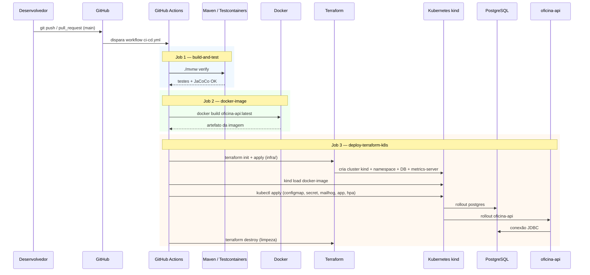

### Pipeline resumido

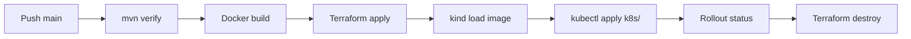

| Etapa | Ferramenta | Artefato / resultado |
|-------|------------|----------------------|
| Build & testes | Maven, JUnit, Testcontainers, JaCoCo | JAR validado + relatório de cobertura |
| Imagem | Docker multi-stage | `oficina-api:latest` |
| Infraestrutura | Terraform (`infra/`) | Cluster kind, DB, metrics-server |
| Deploy app | kubectl (`k8s/`) | API, MailHog, ConfigMap, Secret, HPA |
| Validação | kubectl rollout | Pods `Running` |
| Limpeza | terraform destroy | Cluster efêmero removido no CI |

---

## 6) Fluxo de uma requisição (exemplo: transição de status)

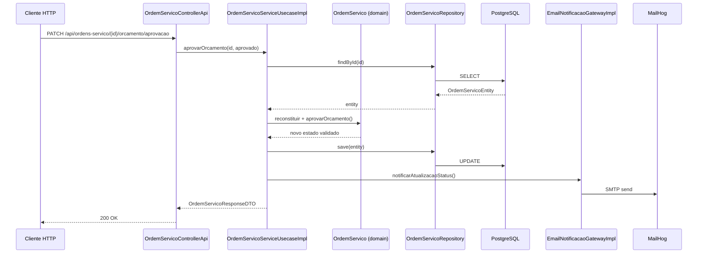

---

## 7) Segurança e configuração externa

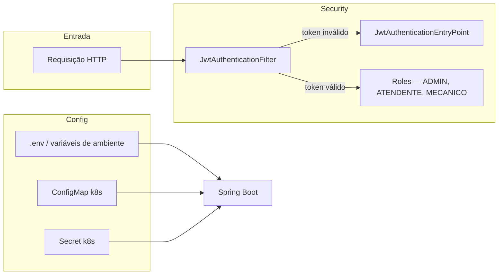

| Segredo / configuração | Onde é definido |
|------------------------|-----------------|
| `JWT_SECRET` | `.env`, Secret k8s, GitHub Secret (CI) |
| Credenciais PostgreSQL | `.env`, Secret k8s, Terraform `kubernetes_secret.db` |
| Host SMTP / MailHog | ConfigMap k8s, `.env` |

---

## 8) Mapa de diretórios da solução

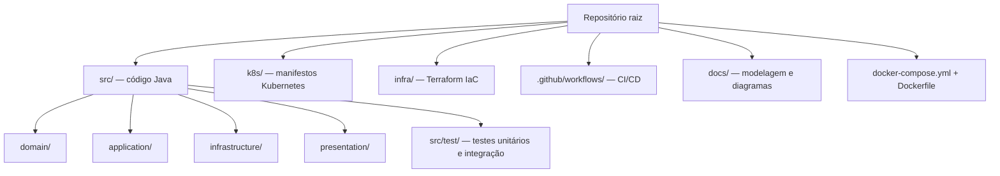

---

## 9) Escalabilidade (HPA)

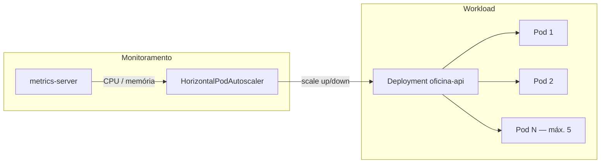

| Parâmetro HPA | Valor |
|---------------|-------|
| `minReplicas` | 1 |
| `maxReplicas` | 5 |
| CPU target | 70% |
| Memory target | 80% |

Sob carga, o HPA solicita réplicas adicionais ao Deployment; o Service `NodePort` distribui o tráfego entre os pods disponíveis.

---

## 10) Legenda

| Símbolo | Significado |
|---------|-------------|
| Retângulo | Componente ou serviço |
| Cilindro `[( )]` | Banco de dados / persistência |
| Seta sólida | Fluxo de dados ou chamada |
| Seta tracejada | Implementação de interface / cross-cutting |
| Subgrafo | Agrupamento lógico ou físico |

---

*Tech Challenge — Pós-Graduação FIAP · Fase 2 · Gestão de Oficina Mecânica*
