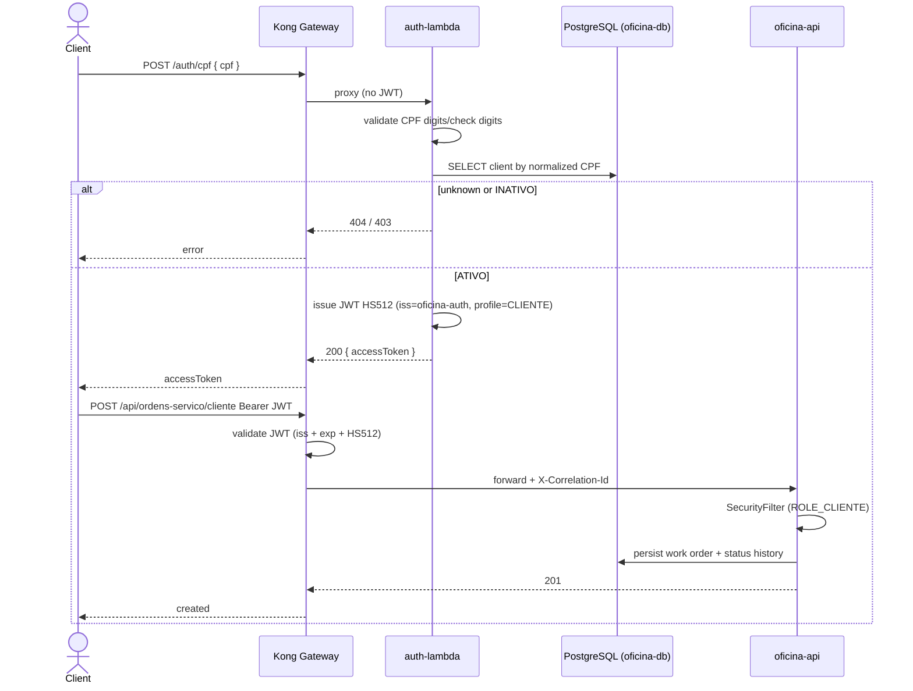
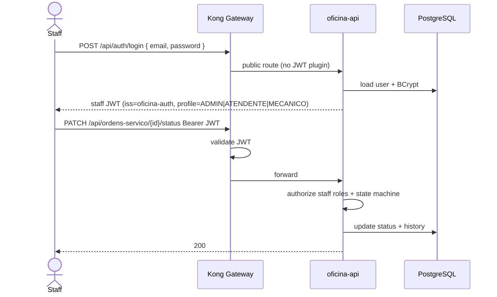
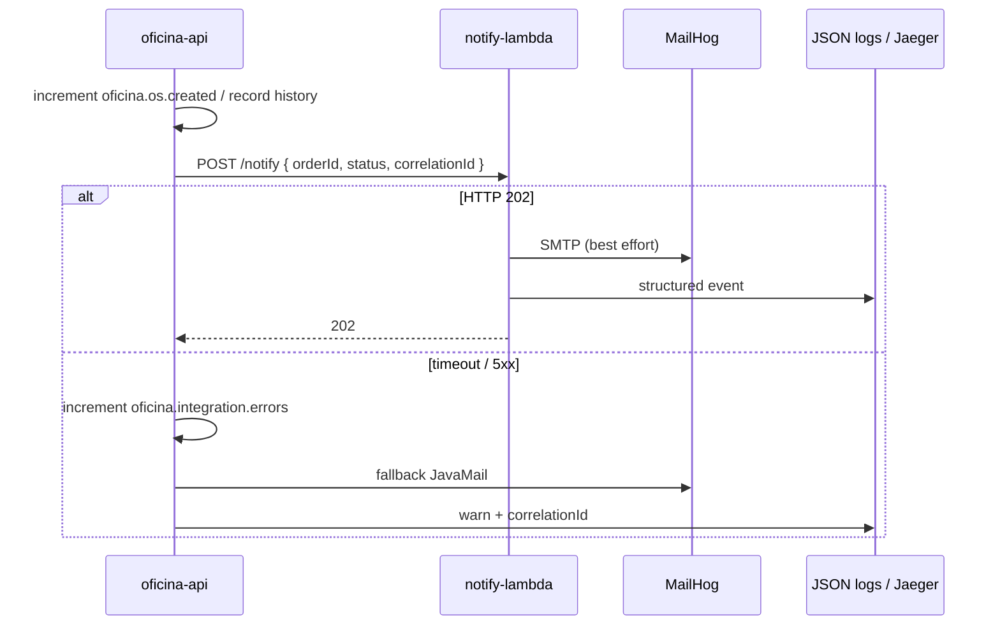

# Sequence diagrams — Fase 3 (local cloud simulation)

## 1) Client authentication by CPF

```mermaid
sequenceDiagram
    actor Client
    participant Kong as Kong Gateway
    participant Auth as auth-lambda
    participant DB as PostgreSQL (oficina-db)
    participant API as oficina-api

    Client->>Kong: POST /auth/cpf { cpf }
    Kong->>Auth: proxy (no JWT)
    Auth->>Auth: validate CPF digits/check digits
    Auth->>DB: SELECT client by normalized CPF
    alt unknown or INATIVO
        Auth-->>Kong: 404 / 403
        Kong-->>Client: error
    else ATIVO
        Auth->>Auth: issue JWT HS512 (iss=oficina-auth, profile=CLIENTE)
        Auth-->>Kong: 200 { accessToken }
        Kong-->>Client: accessToken
        Client->>Kong: POST /api/ordens-servico/cliente Bearer JWT
        Kong->>Kong: validate JWT (iss + exp + HS512)
        Kong->>API: forward + X-Correlation-Id
        API->>API: SecurityFilter (ROLE_CLIENTE)
        API->>DB: persist work order + status history
        API-->>Kong: 201
        Kong-->>Client: created
    end
```

## 2) Staff login and protected operations

```mermaid
sequenceDiagram
    actor Staff
    participant Kong as Kong Gateway
    participant API as oficina-api
    participant DB as PostgreSQL

    Staff->>Kong: POST /api/auth/login { email, password }
    Kong->>API: public route (no JWT plugin)
    API->>DB: load user + BCrypt
    API-->>Staff: staff JWT (iss=oficina-auth, profile=ADMIN|ATENDENTE|MECANICO)
    Staff->>Kong: PATCH /api/ordens-servico/{id}/status Bearer JWT
    Kong->>Kong: validate JWT
    Kong->>API: forward
    API->>API: authorize staff roles + state machine
    API->>DB: update status + history
    API-->>Staff: 200
```

## 3) Notification on status change

```mermaid
sequenceDiagram
    participant API as oficina-api
    participant Notify as notify-lambda
    participant Mail as MailHog
    participant Log as JSON logs / Jaeger

    API->>API: increment oficina.os.created / record history
    API->>Notify: POST /notify { orderId, status, correlationId }
    alt HTTP 202
        Notify->>Mail: SMTP (best effort)
        Notify->>Log: structured event
        Notify-->>API: 202
    else timeout / 5xx
        API->>API: increment oficina.integration.errors
        API->>Mail: fallback JavaMail
        API->>Log: warn + correlationId
    end
```
