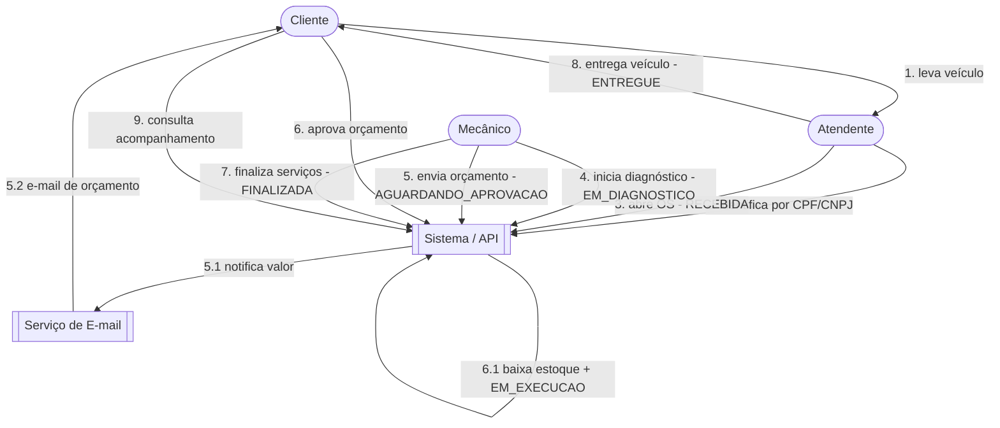

# Domain Storytelling - Oficina Mecânica

O Domain Storytelling descreve, em linguagem do negócio, **como os atores interagem** para levar uma
Ordem de Serviço (OS) do recebimento do veículo até a entrega ao cliente.

## Atores e sistemas

| Ator / Sistema | Papel |
|---|---|
| **Cliente** | Dono do veículo. Solicita o atendimento e acompanha a OS. |
| **Atendente** | Recebe o veículo, cadastra cliente/veículo e abre a OS. |
| **Mecânico** | Faz o diagnóstico, monta o orçamento e executa os serviços. |
| **Sistema (API)** | Calcula o orçamento, controla as transições de status e dispara notificações. |
| **Serviço de E-mail** | Entrega as notificações de mudança de status (MailHog no ambiente local). |

## Narrativa principal (happy path)

> A frase numerada representa o "work item" entre um ator (sujeito), uma atividade (verbo) e um objeto.

1. O **Cliente** leva o **veículo** ao **Atendente**.
2. O **Atendente** identifica o **cliente** pelo **CPF/CNPJ** no **Sistema**.
3. O **Atendente** abre uma **Ordem de Serviço** (status `RECEBIDA`) para o **veículo**.
4. O **Mecânico** inicia o **diagnóstico** da **OS** (status `EM_DIAGNOSTICO`).
5. O **Mecânico** envia o **orçamento** ao **Cliente** (status `AGUARDANDO_APROVACAO`); o **Sistema** calcula o **valor** e notifica por **e-mail**.
6. O **Cliente** **aprova** o **orçamento**; o **Sistema** baixa o **estoque** de peças/insumos e move a OS para `EM_EXECUCAO`.
7. O **Mecânico** **finaliza** os **serviços** (status `FINALIZADA`).
8. O **Atendente** **entrega** o **veículo** ao **Cliente** (status `ENTREGUE`).
9. O **Cliente** **consulta** o **acompanhamento** da **OS** informando o **CPF/CNPJ**.

## Diagrama da narrativa (Domain Story)

## Variações / exceções

- **Orçamento reprovado:** no passo 6, se o **Cliente** não aprova, a OS volta para `RECEBIDA` e nenhum
  estoque é consumido.
- **Estoque insuficiente:** na aprovação, se faltar peça/insumo, a operação é rejeitada e a OS permanece
  em `AGUARDANDO_APROVACAO`.
- **Transição inválida:** qualquer tentativa de pular etapas (ex.: entregar uma OS que não está
  `FINALIZADA`) é bloqueada pelo agregado `OrdemServico`.
