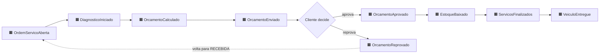
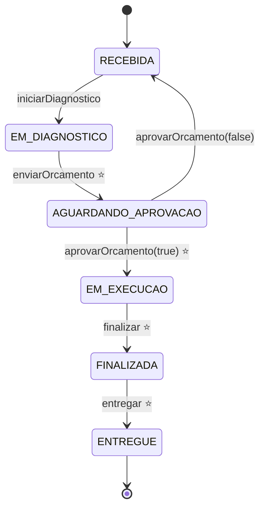
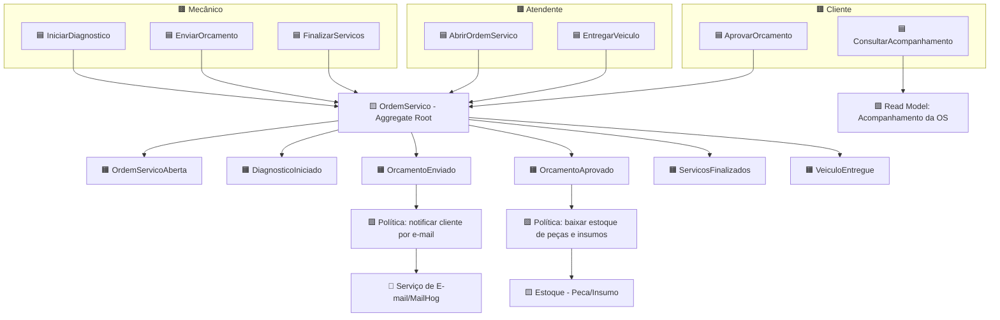
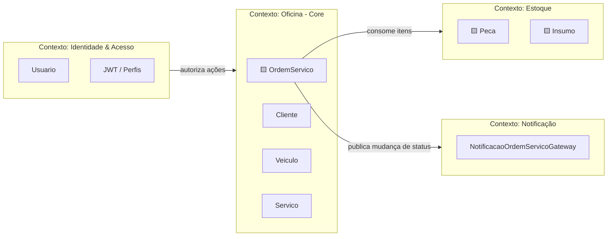

# Event Storming - Oficina Mecânica

Evolução do modelo a partir do Event Storming, seguindo as etapas: **brainstorm de eventos →
linha do tempo → eventos pivotais → comandos/políticas/agregados → contextos delimitados**.

Legenda das cores (notação clássica):

- 🟧 **Evento de domínio** (fato no passado)
- 🟦 **Comando** (intenção/ação)
- 🟨 **Agregado** (onde a regra é aplicada)
- 🟪 **Política** (reação automática: "sempre que... então...")
- 🟩 **Read model** (informação para leitura/decisão)
- 🟫 **Ator**
- 🌸 **Sistema externo**

## 1. Brainstorm de eventos (não ordenado)

`OrdemServicoAberta`, `DiagnosticoIniciado`, `OrcamentoCalculado`, `OrcamentoEnviado`,
`OrcamentoAprovado`, `OrcamentoReprovado`, `EstoqueBaixado`, `ServicosFinalizados`,
`VeiculoEntregue`, `ClienteCadastrado`, `VeiculoCadastrado`, `PecaAdicionadaNaOrdem`,
`NotificacaoEnviada`, `AcompanhamentoConsultado`.

## 2. Linha do tempo (eventos ordenados)

## 3. Eventos pivotais (mudam o estado/fase do negócio)

Os eventos pivotais marcam a transição entre fases e correspondem às transições de estado do agregado:

- ⭐ **OrcamentoEnviado** — separa "diagnóstico" de "negociação com o cliente".
- ⭐ **OrcamentoAprovado** — separa "negociação" de "execução" (e dispara baixa de estoque).
- ⭐ **ServicosFinalizados** — separa "execução" de "entrega".
- ⭐ **VeiculoEntregue** — encerra o ciclo da OS.

## 4. Comandos, atores, políticas e agregados

### Políticas (reações automáticas)

- **Sempre que** um `OrcamentoEnviado` ocorre, **então** o sistema envia uma notificação por e-mail ao cliente.
- **Sempre que** um `OrcamentoAprovado` ocorre, **então** o sistema baixa o estoque das peças e insumos vinculados.
- **Sempre que** um status muda (`*`), **então** o sistema notifica a atualização por e-mail.

## 5. Contextos delimitados (Bounded Contexts)

### Mapa de relacionamento

| Contexto | Responsabilidade | Relação |
|---|---|---|
| **Oficina (Core)** | Ciclo de vida da OS, cliente, veículo, serviços. | Núcleo do negócio. |
| **Estoque** | Disponibilidade e baixa de peças/insumos. | Fornecedor (upstream) consumido pela OS. |
| **Notificação** | Entrega de e-mails de mudança de status. | Conformista a jusante (downstream), acionado por política. |
| **Identidade & Acesso** | Usuários, autenticação JWT e perfis. | Suporte/cross-cutting que autoriza comandos. |

## 6. Do Event Storming ao código

| Conceito do Event Storming | Implementação |
|---|---|
| Agregado `OrdemServico` | `domain/model/OrdemServico.java` (máquina de estados rica) |
| Comandos de transição | métodos `iniciarDiagnostico()`, `enviarOrcamento()`, `aprovarOrcamento()`, `finalizar()`, `entregar()` |
| Eventos pivotais | mudanças de `StatusOrdemServico` validadas no agregado |
| Política de notificação | `NotificacaoOrdemServicoGateway` + `EmailNotificacaoGatewayImpl` |
| Política de baixa de estoque | `OrdemServicoServiceUsecaseImpl.consumirEstoque*` |
| Value Objects | `domain/model/vo/CpfCnpj.java`, `domain/model/vo/Placa.java` |
| Exceções de domínio | `DomainException`, `TransicaoStatusInvalidaException` |
